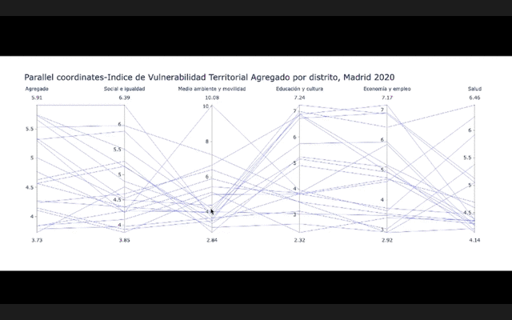

# PEC2 Visualización de datos (UOC)

En este repositorio se pueden encontrar las distintas visualizaciones requeridas para la PEC2 de la asignatura Visualizacion de datos del Master de Ciencia de Datos de la UOC.

Este documento recoge exclusivamente las gráficas finales. Toda la información sobre los conjuntos de datos utilizados, las librerías empleadas así como otras gráficas intermedias se puede consultar en el siguiente cuaderno de Jupyter Notebook: ['viz2.ipynb'](viz2.ipynb) o en el video remitido a través del campus.

## Cartograma

Cartograma no contiguo, que utiliza como fondo el mapa no distorsionado de Madrid, para resultar más inteligible. Muestra el índice de vulnerabilidad territorial agregado por distrito (2020)

Cartograma no contiguo, eliminando la silueta de Madrid de fondo.

## Parallel Coordinates

Esta es la versión estática de la visualización interactiva mostrada en el gráfico para demostrar cómo funciona el brushing.

Este gráfico, generado con la librería Plotly permite filtrar los valores arrastrando sobre los ejes el ratón, tal y como se muestra en la siguiente animación:

Si se quieren probar las funcionalidades interactivas puede descargarse la versión completa desde el siguiente enlace: https://github.com/elsatch/pec2-visualizacion-datos/blob/main/visualization/paralell_coordinates.html

Github no muestra ahora mismo ficheros html de tamaño tan grande.

## Connected Scatterplot

### Connected Scatterplot con una variables

### Connected Scatterplot con dos variables

P.D Recomendamos encarecidamente revisar el cuaderno de Jupyter Notebook para ver la evolución de la solución propuesta.