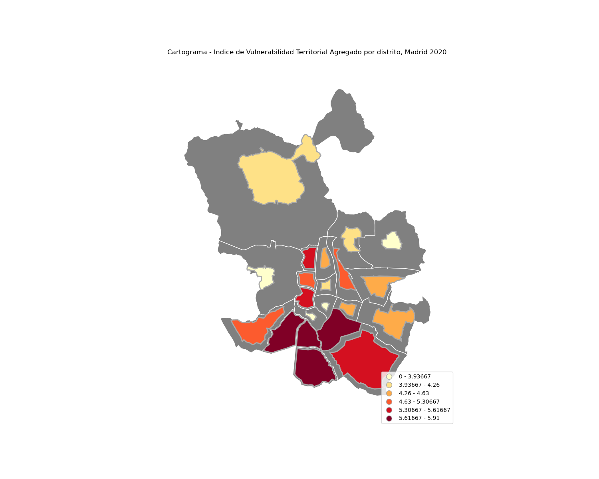
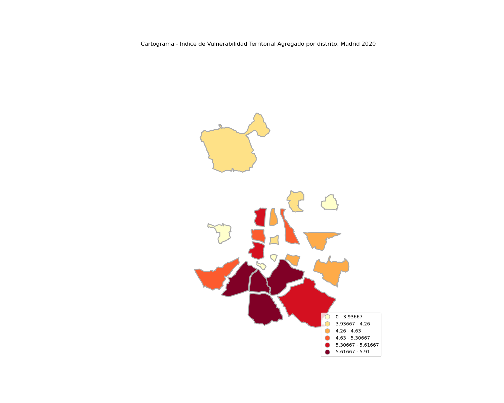
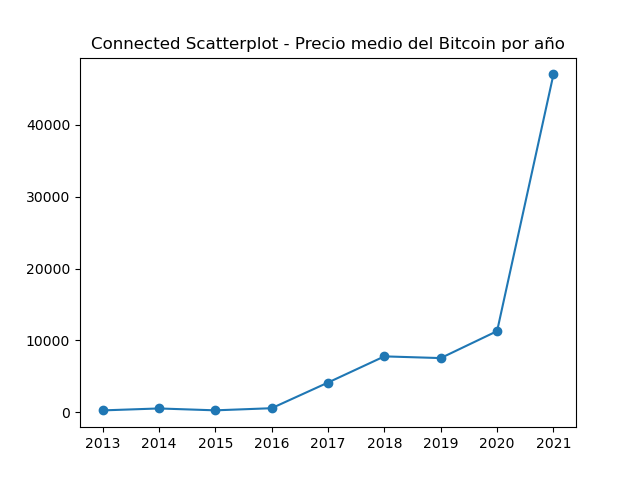
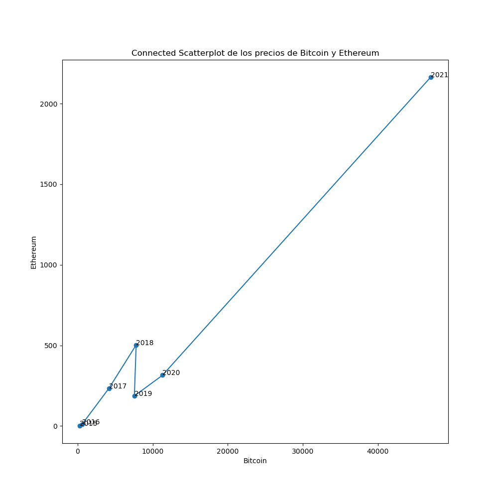

# PEC2 Visualización de datos (UOC)

En este repositorio se pueden encontrar las distintas visualizaciones requeridas para la PEC2 de la asignatura Visualizacion de datos del Master de Ciencia de Datos de la UOC.

Este documento recoge exclusivamente las gráficas finales. Toda la información sobre los conjuntos de datos utilizados, las librerías empleadas así como otras gráficas intermedias se puede consultar en el siguiente cuaderno de Jupyter Notebook: ['viz2.ipynb'](viz2.ipynb) o en el video remitido a través del campus.

## Cartograma

## Parallel Coordinates

Este gráfico también puede visualizarse de forma interactiva en el [siguiente enlace]('./visualization/parallel_coordinates.html')

## Connected Scatterplot

### Connected Scatterplot con una variables

### Connected Scatterplot con dos variables

P.D Recomendamos encarecidamente revisar el cuaderno de Jupyter Notebook para ver la evolución de la solución propuesta.